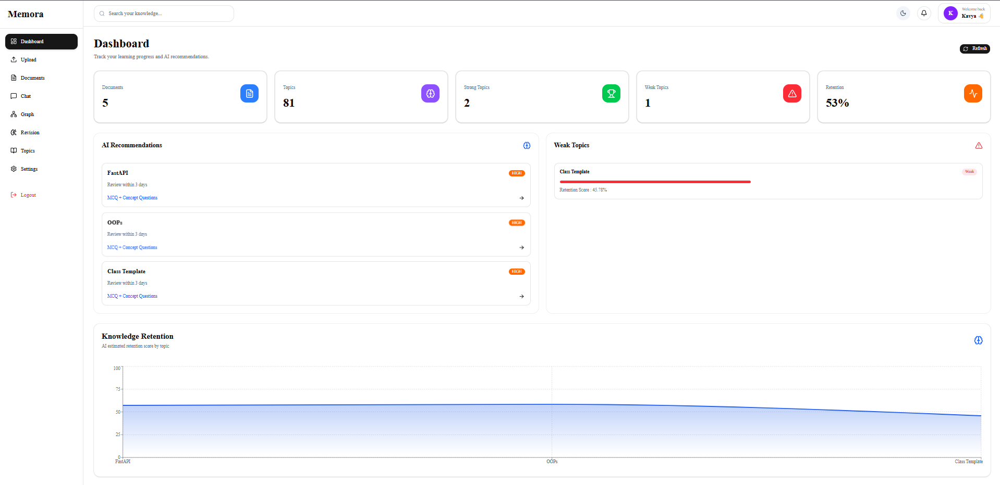
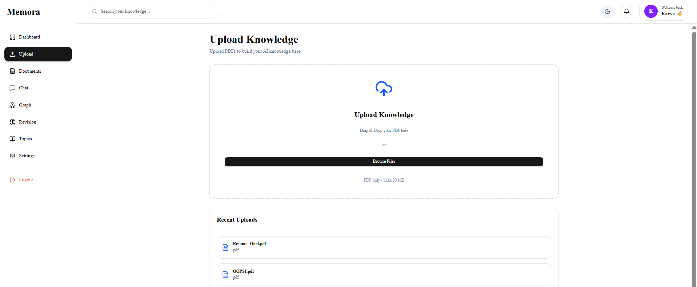
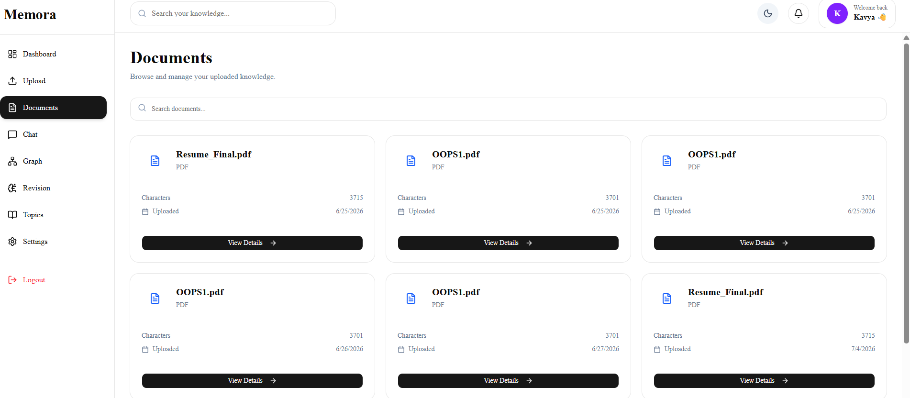
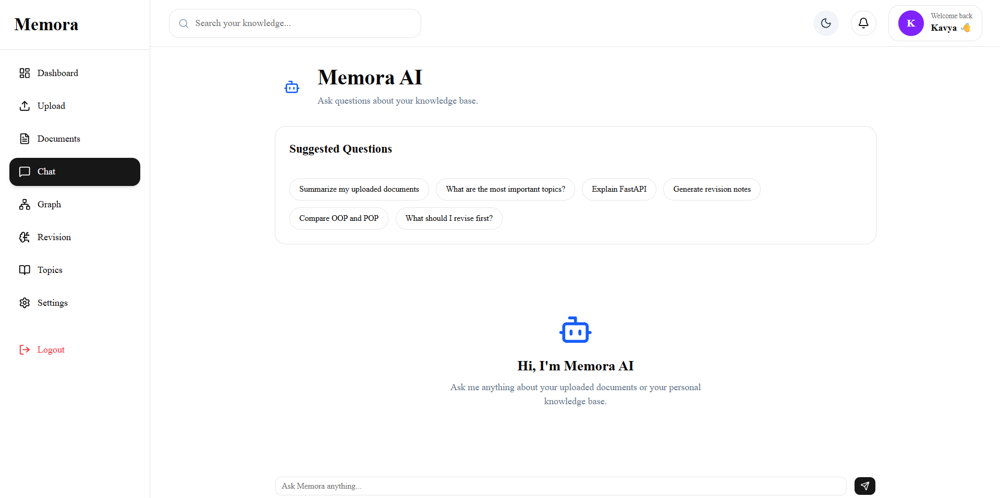
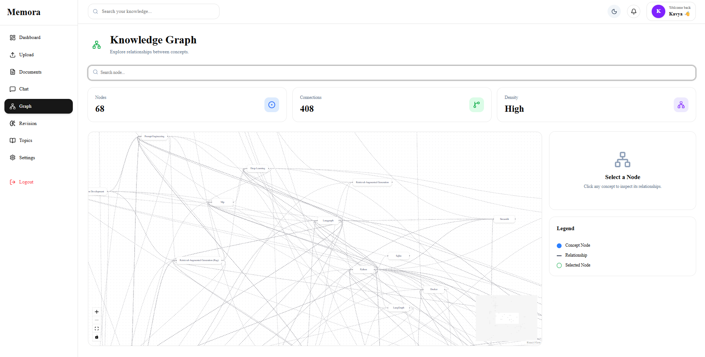
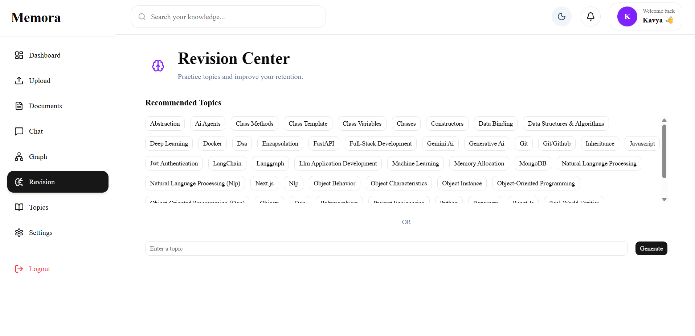
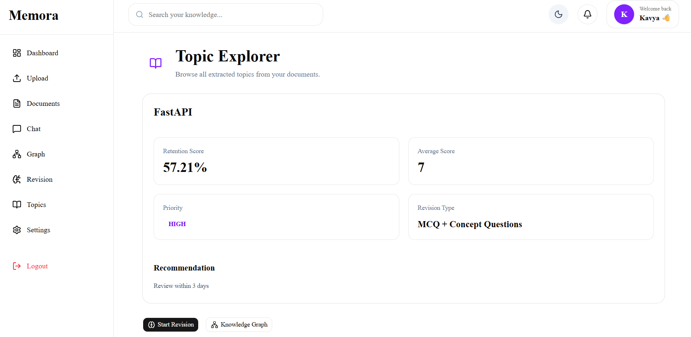
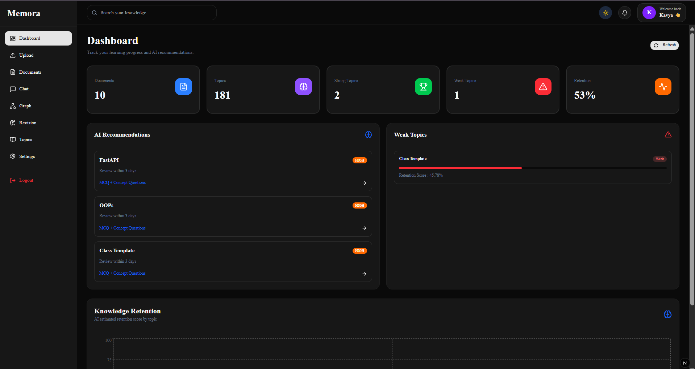

# 🧠 Memora

> **Your AI-Powered Second Brain**  
> An intelligent knowledge management platform that transforms documents into a searchable, AI-powered knowledge base using Retrieval-Augmented Generation (RAG), semantic search, knowledge graphs, and personalized revision recommendations.

<p align="center">


</p>

---

## 🌐 Live Demo

### 🚀 Frontend

**[memora-sigma-six.vercel.app](https://memora-sigma-six.vercel.app/)**

### ⚡ Backend API

**[memora-production-3fae.up.railway.app](https://memora-production-3fae.up.railway.app/docs)**

---

# ✨ Features

## 📄 Smart Document Upload

- Upload PDF documents
- Automatic text extraction
- Intelligent document chunking
- Stores document metadata
- Cloud-based vector storage

---

## 🔍 Semantic Search

Search documents using natural language instead of keywords.

- Embedding-based retrieval
- Context-aware search
- Instant results
- Powered by Qdrant Vector Database

---

## 💬 AI Chat (RAG)

Ask questions about uploaded documents.

- Retrieval-Augmented Generation
- Google Gemini integration
- Context-aware responses
- Source-aware answers

---

## 🧠 Knowledge Graph

Automatically generates relationships between concepts.

- Topic extraction
- Relationship detection
- Interactive graph visualization
- Better understanding of connected knowledge

---

## 📚 AI Revision Engine

Personalized revision recommendations based on retention score.

- Weak topic detection
- Revision priority
- Suggested revision strategy
- Retention analytics

---

## 📊 Dashboard Analytics

Track your learning progress.

- Documents uploaded
- Topics discovered
- Strong topics
- Weak topics
- Average retention score

---

## 🌙 Modern UI

- Responsive Design
- Dark Mode
- Beautiful Dashboard
- Mobile Friendly
- Interactive Search
- Notification System

---

# 🏗 Architecture

```text
                PDF Upload
                     │
                     ▼
              Text Extraction
                     │
                     ▼
              Document Chunking
                     │
                     ▼
           Sentence Embeddings
                     │
                     ▼
           Qdrant Vector Database
                     │
                     ▼
           Semantic Retrieval
                     │
                     ▼
          Google Gemini (RAG)
                     │
                     ▼
            AI Generated Answer
```

---

# 🛠 Tech Stack

## Frontend

- Next.js
- React
- Tailwind CSS
- shadcn/ui
- Axios
- Lucide Icons

---

## Backend

- FastAPI
- Python
- JWT Authentication
- PyMuPDF

---

## AI & ML

- Google Gemini API
- Sentence Transformers
- all-MiniLM-L6-v2
- Retrieval-Augmented Generation (RAG)

---

## Database

- MongoDB Atlas
- Qdrant Cloud

---

## Deployment

- Vercel
- Railway

---

# 📂 Project Structure

```
Memora
│
├── backend
│   ├── app
│   ├── api
│   ├── services
│   ├── database
│   ├── schemas
│   └── main.py
│
└── frontend
    ├── app
    ├── components
    ├── services
    ├── context
    └── public
```

---

# 🚀 Getting Started

## Clone Repository

```bash
git clone https://github.com/YOUR_USERNAME/Memora.git
```

---

## Backend

```bash
cd backend

python -m venv venv

venv\Scripts\activate

pip install -r requirements.txt

uvicorn main:app --reload
```

---

## Frontend

```bash
cd frontend

npm install

npm run dev
```

---

# 🔑 Environment Variables

## Backend (.env)

```env
GEMINI_API_KEY=

JWT_SECRET_KEY=

MONGODB_URL=

DATABASE_NAME=

ALGORITHM=HS256

ACCESS_TOKEN_EXPIRE_MINUTES=60

QDRANT_URL=

QDRANT_API_KEY=

QDRANT_COLLECTION=memora_chunks
```

---

## Frontend (.env.local)

```env
NEXT_PUBLIC_API_URL=
```

---

## 📸 Application Preview

| Dashboard | Upload |
|-----------|---------|
|  |  |

| Documents | Chat |
|-----------|------|
|  |  |

| Graph | Revision |
|-------|----------|
|  |  |

| Topics | Dark Mode |
|--------|-----------|
|  |  |

---

# 🔮 Future Improvements

- Background document processing
- Batch embedding generation
- DOCX & PPT support
- YouTube transcript ingestion
- OCR for scanned PDFs
- AI flashcards
- Spaced repetition scheduler
- Team collaboration
- Voice-based AI assistant

---

# 🤝 Contributing

Contributions, issues, and feature requests are welcome!

Feel free to fork the repository and submit a pull request.

---

# 👨‍💻 Author

**Kavya Agarwal**

GitHub: https://github.com/KA18202005

---

# ⭐ Support

If you found this project useful,

please consider giving it a ⭐ on GitHub.

It really helps!
